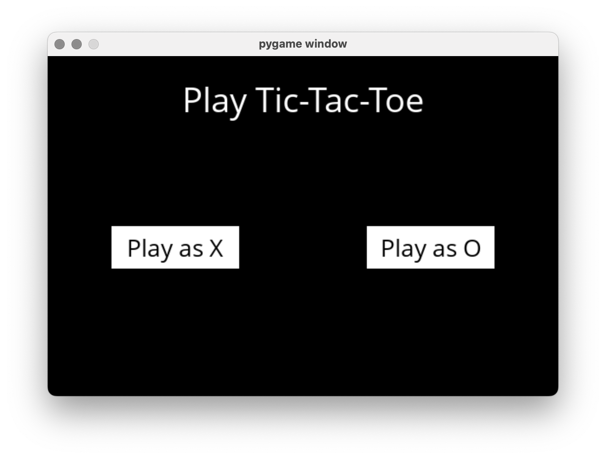

# Tic-Tac-Toe with Pygame and Minimax Algorithm

This project implements a simple game of Tic-Tac-Toe using the Pygame library. You can play against an AI opponent that makes optimal moves using the minimax algorithm.

## 📸 Screenshot



## 📑 Table of Contents

- [Prerequisites](#prerequisites)
- [Installation](#installation)
- [How to Play](#how-to-play)
- [AI Opponent](#ai-opponent)


## ✅ Prerequisites

To run this project, you'll need the following:

- Python 3.x
- Pygame library (already included in the project)

## 💾 Installation

1. Clone the repository to your local machine:

   ```bash
   git clone https://github.com/your-username/tic-tac-toe-pygame.git

## 🎮 How to Play

 1.  use runner.py to open game
 2.  When the game starts, you'll see a menu to choose your player: X or O. Click the respective button to select
 3.  The game board will appear. Click on an empty cell to make your move.
 4.  The AI opponent (if you didn't select it as your player) will make moves using the Minimax algorithm.
 5.  The game will continue until there is a winner or a tie. The result will be displayed at the top of the game window.
 6.  Click the Play Again button to restart the game.
    
## 🤖 AI Opponent
 The AI uses the Minimax algorithm to make optimal moves. It evaluates all possible game states to choose the best move, aiming to:

* Maximize its chances of winning

* Minimize the chances of losing

Try to beat the AI in this classic game of strategy!


  


